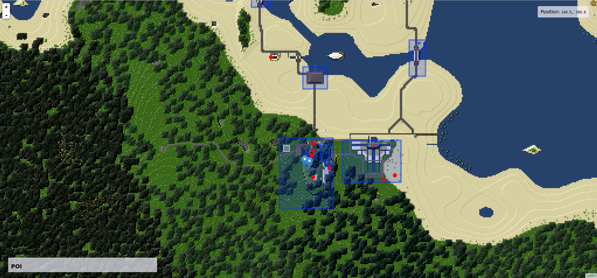

# Minetest Map

[](https://travis-ci.org/deVinnnie/minetest-map-thingy)

Show current player positions, protected areas, and travelnets on a 2D map of a minetest world.



Run with Docker:
```
docker-compose build && docker-compose up --force-recreate
```

Run with gradle (for dev):
```
gradle bootRun
```

## What is it? And what does this thing do?

* It's a little Spring Boot application which serves a REST-api and a modified [leaftest](https://github.com/est31/leaftest) frontend.
* The application is meant to be deployed as a sidecar to a Minetest server.
* The application expects a pregenerated set of map tiles.
* Player positions from the files backend are shown as red dots.
* Protected areas from the [areas mod](https://forum.minetest.net/viewtopic.php?t=7239) are drawn as blue rectangles.
* Travelnet stations from the [travelnets mod](https://forum.minetest.net/viewtopic.php?t=4877) are shown as pinpoints.

## Why did you build this?

While introducing friends who never played Minetest before I noticed many of them getting lost.
Despite the availability of teleporters most players would stick to the same area.
I thought giving them a map would help them find their way around.

## Is this realtime?

Nope. The data reflects a snapshot at the moment that the map is loaded.
A page refresh reloads the data. (I could use some javascript trickery to make it update on interval).


---

Leaflet code adapted from [est31/leaftest](https://github.com/est31/leaftest)
