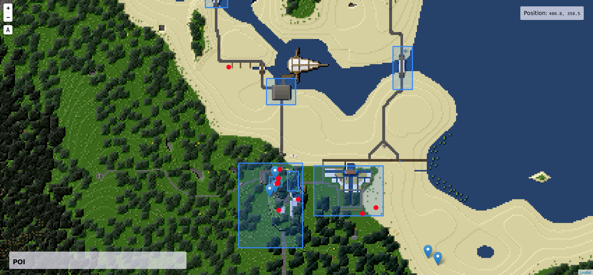

# Minetest Map

Show current player positions, protected areas, and travelnets on a 2D map of a minetest world.



Build from source:
```
gradle assemble && docker-compose build && docker-compose up --force-recreate
```

Leaflet code adapted from [est31/leaftest](https://github.com/est31/leaftest)